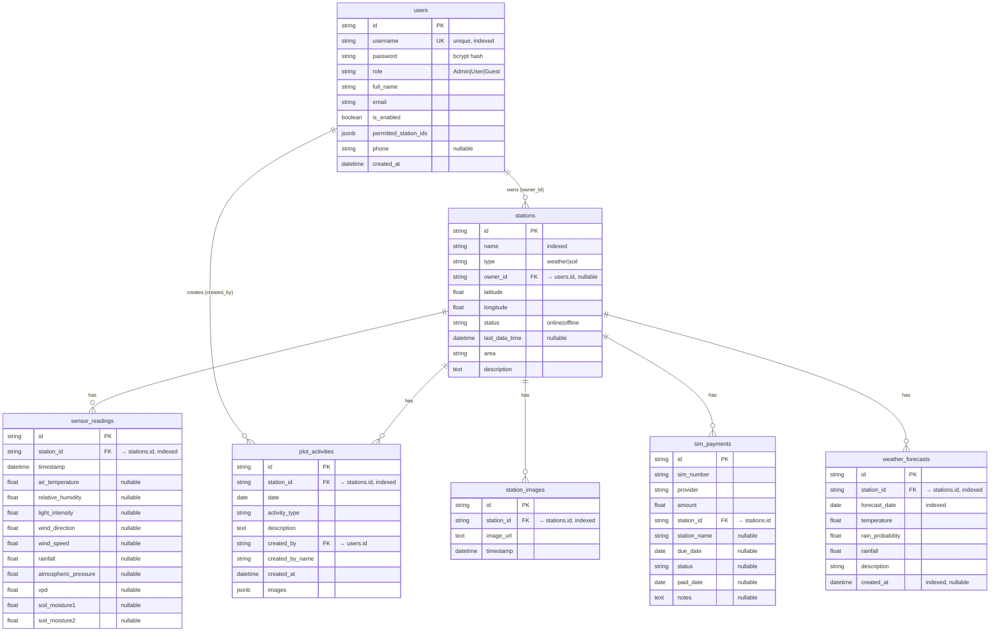

# ER-Diagram — WiMaRC App Database (ข้อ 8.3.2.6 / 4.6.6)

ฐานข้อมูลแอป `wimarc_db` (engine `DATABASE_URL`) — 7 ตารางหลัก
> หมายเหตุ: sensor ดิบ real-time อ่านจาก legacy DB (`CAM_main`/`CAM_client`/`sensor`/`updatedata`) แยกอีกชุด — ไม่อยู่ใน ER นี้ (เป็น read-only external source / Server 1)

## Mermaid ER (render เป็นภาพได้ใน VS Code / mermaid.live)



## ความสัมพันธ์ (สรุป)

| Parent | Child | FK | ความสัมพันธ์ |
|---|---|---|---|
| users | stations | `stations.owner_id` | 1 : N (เจ้าของสถานี) |
| users | plot_activities | `plot_activities.created_by` | 1 : N (ผู้สร้างกิจกรรม) |
| stations | sensor_readings | `sensor_readings.station_id` | 1 : N |
| stations | plot_activities | `plot_activities.station_id` | 1 : N |
| stations | station_images | `station_images.station_id` | 1 : N |
| stations | sim_payments | `sim_payments.station_id` | 1 : N |
| stations | weather_forecasts | `weather_forecasts.station_id` | 1 : N |

## ASCII fallback

```
              ┌─────────┐
              │  users  │
              └────┬────┘
        owner_id   │   created_by
        ┌──────────┴───────────┐
        ▼                      ▼
  ┌──────────┐          ┌────────────────┐
  │ stations │◄─────────┤ plot_activities│
  └────┬─────┘ station_id└────────────────┘
       │ station_id (1:N) → sensor_readings, station_images,
       │                     sim_payments, weather_forecasts
       ▼
 (5 child tables)
```
